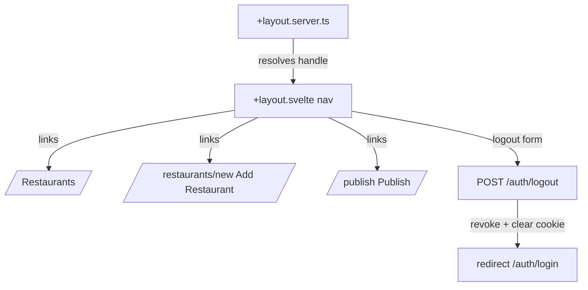

## Context

`admin/src/routes/+layout.svelte` currently only imports Pico CSS and wraps children in `<main class="container">` — no persistent chrome. Navigation today is two inline text links (`/publish` link on the home page, "Back to list" on publish and edit pages), and there is no logout route. The home page (`admin/src/routes/+page.svelte` / `+page.server.ts`) currently combines the restaurant list/search with the add-restaurant form (`RestaurantForm`) and its `create` action side by side; this change splits the add form onto its own route. `hooks.server.ts` gates every path except `/auth/login`, `/auth/callback`, `/client-metadata.json` on a `foodmap_admin_session` cookie holding a DID, and sets `event.locals.session` (an `OAuthSession`, DID only — no handle) via `client.restore(did)`. The callback route (`auth/callback/+server.ts`) shows the existing pattern for resolving a handle (`client.identityResolver.resolve(session.did)`) and for revoking a session (`client.revoke(session.did)`). See proposal.md for motivation.

## Goals / Non-Goals

**Goals:**
- One persistent nav component, driven by route data, present on every gated page.
- A working logout action reusing the existing revoke/cookie-clear pattern from callback.
- Mobile-first responsive layout using the existing `900px` breakpoint from `+page.svelte`.
- Add Restaurant as its own route/nav destination, separate from the restaurant list.

**Non-Goals:**
- Redesigning the restaurant list/edit/publish pages themselves beyond removing redundant links.
- Building a generic multi-level nav/sidebar system — there are only two destinations plus logout.
- Deciding the hamburger open/close animation technique now (see Open Questions).

## Decisions

**Nav lives in `+layout.svelte`, gated by a layout server load.**
Add `+layout.server.ts` that resolves the signed-in handle (mirroring callback's `identityResolver.resolve`) and returns `{ handle }` for the nav to display, and skips rendering nav data on `/auth/login` (already public per `hooks.server.ts`). Alternative considered: resolve identity in `hooks.server.ts` and stash on `locals` — rejected because `hooks.server.ts` already does one identity resolution during login (in callback) and adding a resolve call to every request in hooks would mean an extra network call per request; a layout load is easier to scope down later (e.g. cache) without touching the auth gate.

**Reuse the `900px` breakpoint from `+page.svelte`'s `.layout` media query.**
Keeps the app's only two responsive breakpoints consistent rather than introducing a second value.

**Logout is a form action / server route, not a client-only redirect.**
`POST /auth/logout` (or a `?/logout` action) calls `client.revoke(did)` then `cookies.delete('foodmap_admin_session', { path: '/' })` then `redirect(302, '/auth/login')` — directly mirrors the revoke-on-reject branch already in `auth/callback/+server.ts`, so no new pattern is introduced.

**Add-restaurant form moves to `admin/src/routes/restaurants/new/+page.svelte` + `+page.server.ts`.**
The `create` action and the `existing` restaurants list (used by `RestaurantForm` for duplicate-radius checking) move from `admin/src/routes/+page.server.ts` to the new route's server file; `+page.server.ts` for `/` keeps only `load`/search and drops `create`. `RestaurantForm` itself is unchanged — it already takes `existing` and `formError` as props and doesn't know which route renders it.

**Hamburger toggle uses a `$state` boolean, not `
/
`.**
`
` gives free disclosure behavior but fights later animation (see Open Questions) and Pico's own `
` styling is tuned for dropdown menus, not a full nav panel. A boolean toggle closed on `afterNavigate` (SvelteKit) keeps the panel from staying open across route changes.

## Risks / Trade-offs

- [Resolving the handle on every layout load adds a network call] → acceptable for a low-traffic internal admin tool; revisit only if it becomes noticeably slow.
- [`max-height`/`transform`-based transitions on the mobile panel are a minor CSS hack] → deferred to implementation time per Open Questions; instant show/hide remains a safe fallback if animation proves fiddly.

## Migration Plan

No data migration. Deploy is a normal admin app redeploy; existing sessions are unaffected since the session cookie format doesn't change.

## Open Questions

- Which hamburger open/close animation approach to use (native `
`-adjacent CSS, a `$state`-driven CSS transition, or no animation) — decide at implementation time by trying options in the browser, per proposal discussion. Any of the three options satisfy the "Responsive, mobile-first layout" spec requirements as written, so this doesn't change specs or task breakdown, only how one task is implemented.
