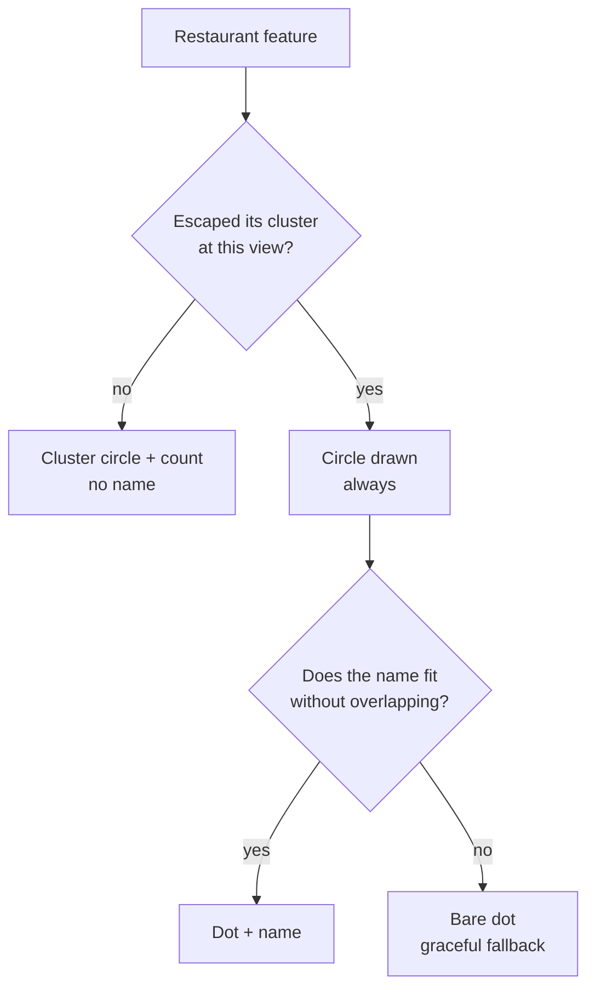
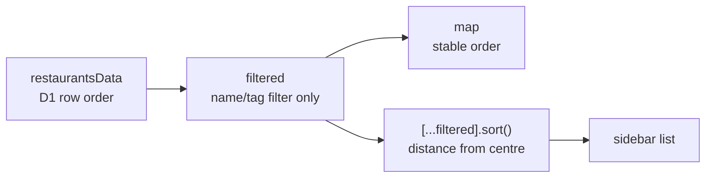
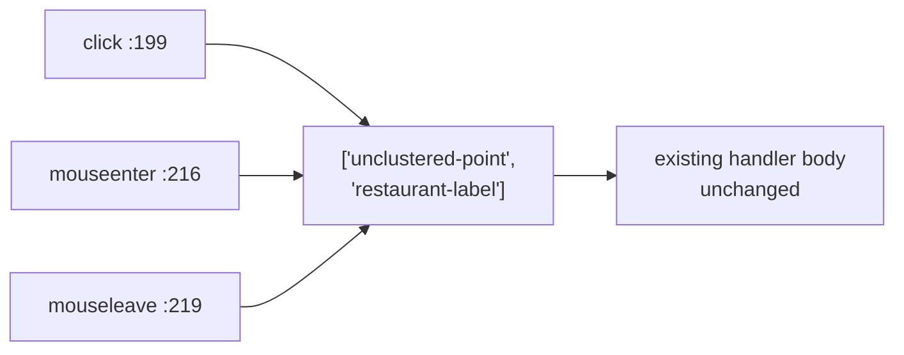

## Context

See `proposal.md` — Why. The constraints that shape the approach:

- `src/lib/components/RestaurantMap.svelte` builds three layers over one clustered
  GeoJSON source: `clusters`, `cluster-count`, `unclustered-point`.
- maplibre-gl 4.7.1, svelte-maplibre-gl 1.0.3.
- The basemap is Carto Voyager **raster**, whose street and POI labels are baked into the
  PNG and therefore cannot participate in label collision.
- The style object declares `glyphs` but no `sprite`. `Noto Sans Regular` is the only font
  stack in proven use (the `cluster-count` layer).

Measurements below are from the live `src/lib/restaurants.json`: 59 restaurants, all with
coordinates, spanning ~13km of London.

**Resolution convention.** MapLibre's world is `512 · 2^z` pixels wide — `worldSize =
tileSize * scale` with `tileSize = 512` (`maplibre-gl-unminified.js:41937`, `:30460`). So

```
metres per pixel = 40075017 · cos(latitude) / (512 · 2^z)
```

which at latitude 51.5 gives **0.743 m/px at z16**. The widely-quoted
`156543 · cos(lat) / 2^z` is the 256px-tile (Google/Leaflet) convention and yields twice
that. Using it here overstates every pixel distance by 2× and inverts the conclusion of
Decision 2. All figures in this document use the 512px form.

## Goals / Non-Goals

**Goals:**
- Label placement that adapts to local density rather than to a global zoom number.
- Keep the change confined to one component with no data or build impact.

**Non-Goals:**
- Any change to the map's zoom limits, clustering parameters, or navigation behaviour.
  See Decision 2.
- Labelling clusters (e.g. "Kaki +2").
- An editorial label-priority model (ratings, favourites). See Decision 6.
- Any redesign of the popup, marker styling, geolocation, or bounds-fitting.

## Decisions

### 1. Trigger on clustering state and collision, not a zoom threshold

A restaurant is labelled when it is drawn as an individual point, with text collision
deciding which of those names survive. The symbol layer carries **no `minzoom`**.



Why: `unclustered-point` is not a proxy for "zoomed in" — it means the point has at least
`clusterRadius` (30px) of screen clearance from every neighbour, recomputed at every zoom.
That is a live, local density measurement the map already performs.

Density varies enormously at a fixed zoom. Nearest-neighbour distance across the dataset:

| percentile | distance | becomes individual at |
|---|---|---|
| p0 | 31m | z15.5 |
| p25 | 69m | z14.4 |
| p50 | 130m | z13.5 |
| p75 | 359m | z12.0 |
| p90 | 969m | z10.6 |

A single `minzoom` cannot serve both ends of that spread — it would either flood dense
areas or leave sparse ones anonymous. This is precisely the reported symptom: from about
z13.5 the median restaurant is an unnamed dot with room to spare.

*Alternatives considered.* A `minzoom` threshold — rejected as above. Counting features in
the viewport from JavaScript and toggling the layer — rejected: it duplicates work
supercluster already does, and replaces a declarative style with imperative state.

### 2. Leave the zoom and clustering envelope alone

`maxZoom` (16, declared at both `:109` and `:362`), `clusterMaxZoom` (16) and
`clusterRadius` (30) are all unchanged by this change.

`clusterMaxZoom` equalling `maxZoom` means clustering never formally switches off at a
reachable zoom, which looks like a bug. Measured against the actual data it is inert:

| | value |
|---|---|
| `clusterRadius` 30px at z16 | **22m** on the ground |
| closest pair in the dataset | **31m** (Ippudo / Kanada-Ya) |
| restaurants still grouped at the z16 ceiling | **0 of 59** |
| zoom at which the closest pair separates | **z15.54** |

Every restaurant is already an individual, labellable point before the ceiling is reached,
so raising `maxZoom` would fix nothing. Nor would the matching change to
`navigateToRestaurant`'s `flyTo` zoom: at z16 the destination is already unclustered.

*Watch item, not a defect.* A restaurant added within ~22m of an existing one **would** be
grouped at every reachable zoom and could never be labelled. That is plausible for two
units in one food hall. It would present as a stubborn two-point cluster that will not
expand at maximum zoom; the fix at that point is to raise `maxZoom` above
`clusterMaxZoom`, not to enlarge `clusterRadius`.

*Alternatives considered.* Raising `maxZoom` to 17 pre-emptively — rejected: it changes
how far the map lets a visitor push in, on a "where shall we eat" map, to guard a case the
data does not contain. It would also remove the two label collisions in Decision 4 by
brute force, but variable anchoring handles those more cheaply.

### 3. Leave `clusterRadius` at 30

Tempting to raise it so that "unclustered" implies "has room for text". Rejected — it
strands restaurants at the ceiling for no gain that collision detection does not already
provide for free:

| clusterRadius | ground distance @z16 | grouped at the ceiling |
|---|---|---|
| **30 (keep)** | 22m | **0 of 59** |
| 50 | 37m | 4 of 59 |
| 60 | 45m | 6 of 59 |
| 80 | 59m | 10 of 59 |

`clusterRadius` has one job — dot versus cluster, calibrated to a 20px circle. Text
spacing is collision detection's job. Overloading one knob to do both buys tidier text at
the cost of permanently hiding names.

### 4. Vertical variable placement: `text-variable-anchor: ['top', 'bottom']`

Testing every pair within 250m at the z16 ceiling for 2D label-box overlap (name width ≈
6.6px/char at 12px, box height ≈ 18px), a fixed `top` anchor yields **55 clean pairs and 2
collisions**:

```
  Xi'an Biang Biang / Yeye's Noodle & Dumpling   dx=48px  dy=11px
  Little Green      / Deun Deun Korean Rest.     dx=64px  dy=10px
```

Both are near-pure east–west pairs: long names, side by side, almost no vertical
separation. Allowing one label to flip above its dot moves them ~30px apart vertically,
clear of the 18px box. Both resolve.

Two anchors, not four. `left`/`right` would only help pairs separated north–south, and
every such pair already has ample vertical clearance. Adding them makes labels wander
around their dots for no measured benefit.

Mechanics that are easy to get wrong: `text-offset` is **ignored** when
`text-variable-anchor` is set — the offset must be `text-radial-offset`. Set
`text-justify: 'auto'` so justification follows the chosen anchor.

### 5. Keep the circle and symbol as separate layers

The dot keeps its own `circle` layer; the label is a new `symbol` layer over the same
source and filter.

Merging them into one symbol layer would unify the hit target and let `text-optional`
express "always show the icon, drop the text when crowded" — but a symbol layer needs
`icon-image`, and the style object declares no `sprite`. Adding a sprite URL or generating
the dot at runtime with `addImage()` is real work for a marginal gain.

Two layers reach the same behaviour for free: the circle layer never collides, so every
restaurant always renders. A dot without a name is exactly today's behaviour — graceful
degradation, not a defect, and it guarantees no restaurant is lost to a typography
decision.

### 6. Label priority: source array order

When labels collide, the survivor is chosen by feature order unless `symbol-sort-key` says
otherwise. Array order is acceptable here because it is stable:



`+page.svelte:88` passes `filtered` to the map and `:117` passes `displayed` to the
sidebar, and `:36` sorts a **copy**. Had that been an in-place `filtered.sort()`, feature
order would reshuffle 500ms after every pan and labels would visibly churn. The spread
already prevents it.

Deferred rather than decided: `symbol-sort-key` needs an editorial notion of prominence,
and the data carries no rating, visit count, or favourite flag to build one from.

### 7. Tappable labels via layer-id arrays

maplibre-gl 4.7.1 supports `on(type, layerIds: string[], listener)`
(`maplibre-gl.d.ts:10175`). Three registrations widen from a string to an array:



Verified in the 4.7.1 source rather than assumed:

- `_createDelegatedListener` performs **one** `queryRenderedFeatures` across the whole
  layer set and invokes the listener once with merged `e.features` — no double-fire when
  dot and label are both under the cursor.
- Layer ids are filtered through `getLayer()` at *event* time, not registration time, so
  handlers may be registered before the label layer is added.

The existing lookup at `:204` (`r.name === name && r.url === url`) remains correct despite
the five duplicate-name brands: all 59 URLs are distinct, so name+url is unique.

### 8. Label text is the name alone

`text-field` reads the name only; `branch` is excluded. See `proposal.md` — Known
limitation, and the `public-map` spec requirement covering it.

## Risks / Trade-offs

- **Ten records render ambiguous labels** (5 brands × 2 locations, all with an empty
  `branch`) → Accepted. The popup already renders `branch`, so the ambiguity costs a tap.
  Populating those records is a data task, not a code change.
- **Labels collide with the basemap's baked-in street names**, which cannot participate in
  collision because the tiles are raster → Mitigate with `text-halo-color` /
  `text-halo-width`. Without a halo this reads as broken, not merely imperfect. Carto's
  `voyager_nolabels` variant is the fallback if the halo proves insufficient, at the cost
  of losing street context.
- **Cursor flicker crossing the gap between dot and label.** The delegated
  `mouseenter`/`mouseleave` keeps one boolean across the layer set, so traversing the
  `text-radial-offset` gap fires leave-then-enter and the cursor blips → Accepted for the
  first version. Desktop only, invisible on touch, and shrinks with the offset.
- **Touch target is wide but short** — roughly 59×18px for a typical name versus the 20px
  dot. Better in area and better aligned with where the eye is, but under the 44px touch
  guideline vertically, and a text-only symbol's hit box cannot be padded without a sprite
  → Accepted; `text-size` is the lever if it feels fiddly on a real device.
- **`Noto Sans Bold` may not exist on `demotiles.maplibre.org`** → Verify before using any
  stack other than `Noto Sans Regular`. A missing font stack fails as invisible text, not
  an error, so this would ship silently broken.
- **Label priority can shift between publishes.** `build-restaurants-data.js:11` is
  `SELECT * FROM restaurants` with no `ORDER BY`, so order is SQLite rowid order; a record
  deleted and re-added lands at the end → Accepted. Cosmetic, and only observable where
  labels collide.
- **A future restaurant within ~22m of another would be unlabellable** → See Decision 2,
  watch item. Detectable as a cluster that will not expand at maximum zoom.

## Migration Plan

No data or schema migration. The change is confined to one component of the public static
site; deploy is an ordinary publish/rebuild from the admin. Rollback is reverting the
commit and republishing — no state is written, so nothing needs undoing.

## Open Questions

- Whether the touch target needs a larger `text-size` after use on a real phone. Affects
  one paint property; changes no requirement, decision, or task.
- Whether label priority eventually warrants `symbol-sort-key`. Needs an editorial signal
  the data does not yet carry, and only matters where labels collide.
