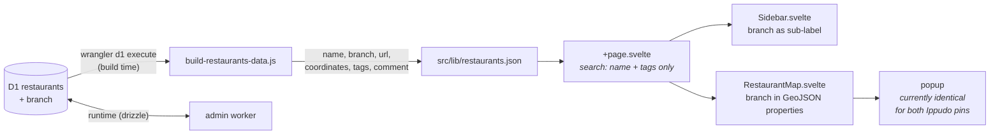

## Context

See `proposal.md` — Why. The constraints that shape the approach:

- **`consolidate-d1-schema` must land first.** It gives `restaurants` a single tracked
  migration directory. Until then there is no safe home for an `ALTER TABLE`.
- **The public site has no server.** It reads D1 exactly once, at build time, through
  `wrangler d1 execute --command "SELECT * FROM restaurants"` in
  `scripts/build-restaurants-data.js`, which shapes rows into `src/lib/restaurants.json`.
  Everything the sidebar and map know comes from that file.
- **`Restaurant` is declared three times.** `Sidebar.svelte` and `RestaurantMap.svelte` each
  carry their own local interface, and the admin has its own drizzle-inferred type. Adding a
  field means touching each independently.
- **The map popup reads `name` and `url` only,** destructured from GeoJSON feature
  properties. Anything not placed in `properties` is invisible to it.

## Goals / Non-Goals

**Goals:**
- Make two locations of one brand distinguishable wherever they are shown.
- Keep the door open to a later brand/location split without a rewrite.
- Purely additive migration — no data statements, no rewrite of existing rows.

**Non-Goals:**
- Backfilling the thirteen affected rows. See `proposal.md` — What Changes.
- Enforcing a branch when a name collides.
- Collapsing branches into a single sidebar card. The sidebar keeps one card per location.
- Specifying the public site's rendering as an OpenSpec capability. See `proposal.md` —
  Capabilities.

## Decisions

### A nullable column on `restaurants`, not a separate brands table

The considered options:

| Option | Shape | Assessment |
|---|---|---|
| **Chosen: `branch` column** | `restaurants.branch TEXT` nullable | One additive migration. Fixes the admin list and the map popup. Tags stay duplicated across branches, which is cheap — every duplicated tag set is one or two words. |
| Rejected for now: brands + locations | `brands(name, tags)` + `locations(brand_id, branch, url, lat, lng)` | Semantically the honest model: the thing liked is the brand, the pins are where to act on it. But it requires a nested admin CRUD on a phone-first app that currently has a flat list and one form, plus a join in the build and a new JSON shape. |
| Rejected: naming convention only | `name = "Ippudo — Soho"` | Already tried, already broken three different ways. Discipline-only, and forces a retroactive rename each time a brand gains a second location. |
| Rejected: `parent_id` self-reference | `restaurants.parent_id` | Ambiguous canonical row; deleting the parent orphans children; unclear which row owns shared fields. |
| Rejected: a `brand:` tag | `tags = "ramen brand:ippudo"` | The tag vocabulary is deliberately small and closed; brands are open-ended and would fragment it. |

The column is chosen against an expected ceiling in the teens of branched brands. `branch` is
precisely the field that would lift into a `locations` table if that ceiling is ever passed,
so this is a step toward the normalized model rather than away from it.

### The build emits `branch` as a field, not baked into `name`

Concatenating at build time (`name: "Ippudo — Soho"`) would need zero public-site changes,
which is genuinely tempting. It is rejected for a correctness reason rather than a purity
one: the branch has to reach the map popup regardless, because two Ippudo pins currently open
two identical popups. Once `branch` is in the GeoJSON properties, keeping it a distinct field
costs nothing further and leaves the sidebar free to style it independently — and matches the
shape a later brands/locations split would want.

The build omits the key entirely when there is no branch, following the existing treatment of
`comment` in `build-restaurants-data.js`.

### The em dash is an admin-list presentation detail only

`<name> — <branch>` is how the admin list renders a row. The public sidebar shows the branch
as its own styled element next to the name, so no separator glyph is involved there, and the
map popup composes its own label. Nothing stores or transmits the joined string.

### Ordering by name then branch

`listRestaurants` currently orders by name alone, which leaves same-name records in
arbitrary relative order. Adding branch as a secondary sort makes the list stable and puts
branches of a brand adjacent, which is what makes the flat list readable without grouping.

### Flat list rather than grouped

A grouped list — a brand heading with its branches nested beneath — was considered and
rejected. Ordering by name then branch already places branches adjacently, so grouping buys
mostly cosmetics in exchange for a second row shape, an extra heading level, and no obvious
home for the tags line, on a layout that is deliberately phone-shaped at every width.

## Risks / Trade-offs

- **Shipping does not fix today's rows** → Accepted and explicit. The five identical-name
  pairs stay indistinguishable in the admin list, and rows 51 (`CoCo Ichibanya (Bond St)`)
  and 11 (`Kova Aldgate`) keep their baked-in suffixes, until each is edited by hand. The
  change delivers the mechanism.
- **Four conventions coexist during the transition** → Identical names, parenthetical suffix,
  bare suffix, and the new column. Real but transitional, and a direct consequence of
  choosing no backfill.
- **Nothing prevents an anonymous branch** → A future `Ippudo` with no branch can sit beside
  `Ippudo — Soho`. The existing 50 m proximity warning will not catch it; branches are
  kilometres apart. Accepted: the workflow stays manual.
- **Freeform labels will be inconsistent** → `Soho` is a district, `Bond St` a street,
  `Aldgate` a station. Accepted deliberately; there is no vocabulary to enforce and the
  labels are only ever read by one person. This is also why branch is excluded from search —
  matching on inconsistent freeform text would give unpredictable results.
- **Three separate `Restaurant` type declarations must stay in step** → Pre-existing
  duplication, not introduced here. Missing one surfaces immediately as a type error under
  `pnpm check` rather than silently.

## Migration Plan

1. Apply `0004_add_branch.sql` to remote **before** deploying the admin worker. Per
   `AGENTS.md`, the layout's server load reads on every authenticated page, so a worker
   selecting a column that does not exist fails the whole admin rather than degrading.
2. Deploy the admin worker.
3. Publish the public site to regenerate `restaurants.json` with the new field.

Steps 1 and 2 are independent of step 3: until a publish happens the public site keeps
serving its existing snapshot, which is valid — every restaurant simply has no branch.

**Rollback:** the column is nullable and additive, so an admin worker that predates it
ignores it and continues to work. Reverting the deploy is sufficient; dropping the column is
not required and would lose any branch labels already entered.
