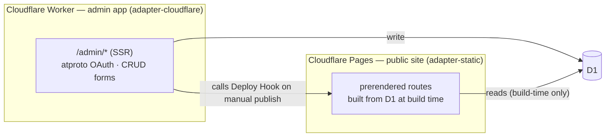

## Context

See proposal.md for motivation. Key constraints shaping this design:
- Today's site is `adapter-static` + prerendering, no backend at all.
- Bluesky/AT Protocol OAuth on `workerd` is known to require a handful of pnpm patches to `@atproto/*` packages (see the Auth decision below), and a D1-backed OAuth state store with an allow-list held outside the repo is a natural fit for this project's needs.
- The public map must stay fully static/offline-capable (PWA); only `/admin` needs a live backend.

## Goals / Non-Goals

**Goals:**
- Keep the public site's static, prerendered, offline-capable behavior fully intact while adding a dynamic `/admin` area.
- Admin writes land in D1 immediately; the public site is rebuilt on demand, within about a minute of the admin triggering a publish.
- Implement atproto auth using the known-working `workerd` patches and D1-backed state store pattern, rather than reinventing the approach from scratch.

**Non-Goals:**
- No multi-user roles/groups — a single flat allow-list is sufficient.
- No live (non-rebuilt) database reads on the public path.
- No offline write support in `/admin` (admin requires connectivity; only the public site needs offline read support).

## Decisions

### Deploy topology: separate Pages project (public) + Worker (admin)
**Decision**: Split into two Cloudflare deployments rather than one unified Worker.

- **Public site**: stays an `adapter-static` SvelteKit build, deployed as a Cloudflare **Pages** project. Its build step reads all restaurant records from D1 (instead of parsing `restaurants.yaml`) and produces the same prerendered static output as today. A Pages **Deploy Hook** (a webhook URL Cloudflare issues per project) triggers a fresh build.
- **Admin app**: a separate, small SvelteKit app using `@sveltejs/adapter-cloudflare`, deployed as its own Cloudflare **Worker**, with its own `wrangler.jsonc` (D1 binding, atproto OAuth). `ALLOWED_HANDLES` and the public site's Pages Deploy Hook URL are set as Cloudflare environment variables/secrets via the dashboard or `wrangler secret`, not committed to `wrangler.jsonc`. Handles `/admin/*` only — atproto sign-in, CRUD forms, D1 reads/writes, and a manual "publish" control that calls the Deploy Hook when the admin activates it.

**Why over a single unified Worker**: the public site keeps its original, simple static-hosting story (real Deploy Hooks, no SSR cost, no cold-start on the hot path visitors hit) and the admin app gets full SSR/auth without forcing that complexity onto the public site. The cost is two deploy pipelines instead of one — accepted as worthwhile to preserve the public site's current static/offline characteristics unchanged.

Admin's own list view reads D1 directly (not the public site's prerendered output), so the admin always sees the latest write immediately, even before the public rebuild finishes.

### Data access: Drizzle ORM over D1
**Decision**: Use `drizzle-orm` with the D1 driver: a schema file under `$lib/server/db`, migrations dir referenced from `wrangler.jsonc`'s `d1_databases[].migrations_dir`.

**Alternative considered**: raw `D1Database` bindings with hand-written SQL. Rejected — Drizzle's schema-as-code plus migrations gives typed queries and a migrations workflow (`drizzle-kit`) for free, and this combination is known to work on `workerd`.

### Auth: atproto OAuth with a D1-backed state store, no groups/roles
**Decision**: Implement `src/lib/server/auth/atproto.ts` with a D1-backed `StateStore`, an in-memory `SessionStore`, and a check against the `ALLOWED_HANDLES` environment variable — no groups/roles, since foodmap only needs "is this handle on the list."

**Patches required** (re-diffed against whatever versions foodmap installs):
- `@atproto/oauth-client`: `oauth-client.js` `redirect: 'error'` → `'manual'`
- `@atproto-labs/did-resolver`: `plc.js` and `web.js`, same fix
- `@atproto-labs/handle-resolver`: `well-known-handler-resolver.js` and `xrpc-handle-resolver.js`, same fix (the latter also gets an explicit 3xx check to preserve the original "reject redirects" intent)

Reason: `workerd` doesn't implement `fetch`'s `redirect: 'error'` mode, which several atproto packages rely on to reject unexpected redirects during DID/handle resolution.

**Scope requested**: bare `atproto` scope only (identity/authenticate) — the admin never calls back into the Bluesky API after sign-in, so no `transition:generic` write scope is needed.

### Allow-list: Cloudflare environment variable, not a database table or repo config
**Decision**: `ALLOWED_HANDLES` as a comma-separated string set as a Cloudflare environment variable on the admin Worker (via the Cloudflare dashboard or `wrangler secret put`), not written into `wrangler.jsonc` or otherwise committed to the repository.

**Why**: this codebase is public, so who has admin access shouldn't be visible in source. A DB table was also considered and rejected — for a single owner (or a handful of trusted editors) who change rarely, updating one Cloudflare-managed value is simpler than a DB migration/UI for something that changes about once a year.

**Alternative considered**: storing the allow-list in `wrangler.jsonc` as a plain `vars` entry (simple, git-tracked). Rejected once the repo is public — a var in `wrangler.jsonc` is committed source and would expose exactly who has access.

### Publish trigger: manual, via a control in the admin app
**Decision**: rather than calling the Deploy Hook automatically after every write, the admin app exposes an explicit "publish" control. Activating it `POST`s to the public site's Pages Deploy Hook URL (configured in the Pages project's dashboard). Writes (create/edit/delete) only touch D1 and never trigger a rebuild as a side effect.

**Why over rebuild-on-write**: adding restaurants in the field often means several saves in a short span (multiple places visited in one outing); rebuilding after each one wastes Pages build minutes and briefly serves the public site through the ~30-60s in-progress-build window more often than necessary. A manual publish lets the admin batch edits and publish once when done.

## Risks / Trade-offs

- [Two deploy pipelines to maintain instead of one] → Accepted trade-off for keeping the public site static; both are simple Cloudflare-native deploys (`wrangler pages deploy` / `wrangler deploy`), not bespoke infra.
- [`workerd` redirect-mode gap could resurface in atproto dependency updates beyond the three known packages] → Pin dependency versions; re-run the patches (or check upstream fixed status) on any atproto package bump.
- [D1 is single-region-ish / not built for high write concurrency] → Not a concern at this scale (single admin, occasional writes).
- [Rebuild latency (~30-60s) means the admin doesn't see their own edit live] → Acceptable per proposal; admin list view can read D1 directly (not the stale prerendered output) so the admin's own UI always reflects the latest write even before a publish.
- [Manual publish means an admin can forget to publish, leaving the public site stale] → Accepted trade-off for batching edits; admin list view reading D1 directly (above) at least keeps the admin's own view accurate regardless.
- [pnpm patches are version-pinned and will need re-diffing as atproto packages update] → Documented in design; treat as expected maintenance, not a one-time cost.
- [Cloudflare Pages Deploy Hooks only exist for a project connected to a Git repository — the public site was originally a direct-upload project with no hook available] → Resolved by connecting the Pages project to its GitHub repo via the dashboard (Settings → Build), which also gains ordinary git-push auto-deploys as a side benefit; the Deploy Hook was then created under Builds & deployments.

## Migration Plan

1. Add D1 database + Drizzle schema (`restaurants` table) and migrations.
2. Run one-time migration script: read `restaurants.yaml`, insert rows into D1 via `wrangler d1 execute --remote`.
3. Scaffold the separate admin app (new SvelteKit project or a sub-app in this repo) with `adapter-cloudflare`, its own `wrangler.jsonc` (D1 binding); set `ALLOWED_HANDLES` and the Pages Deploy Hook URL as Cloudflare environment variables/secrets, not committed to the repo.
4. Implement atproto auth in the admin app (patches, D1 state store, allow-list check), with no groups/roles.
5. Build `/admin` routes in the admin app (list, add/edit form, delete, geolocation button, duplicate warning, manual publish control calling the Pages Deploy Hook).
6. Switch the public site's build step (still `adapter-static`) from parsing `restaurants.yaml` to reading D1 records at build time.
7. Remove `data/restaurants.yaml`, `scripts/parse-restaurants.js`, and the `parse:restaurants` script step, once D1 is confirmed as the working source of truth.
8. Rollback strategy: keep `restaurants.yaml` and the old parse script in git history (not deleted until step 7 is verified in production); reverting the public site is a straightforward adapter/config revert since no other app logic depends on the file existing at runtime. The admin app can simply be un-deployed/disabled without affecting the public site.

## Open Questions

None.
