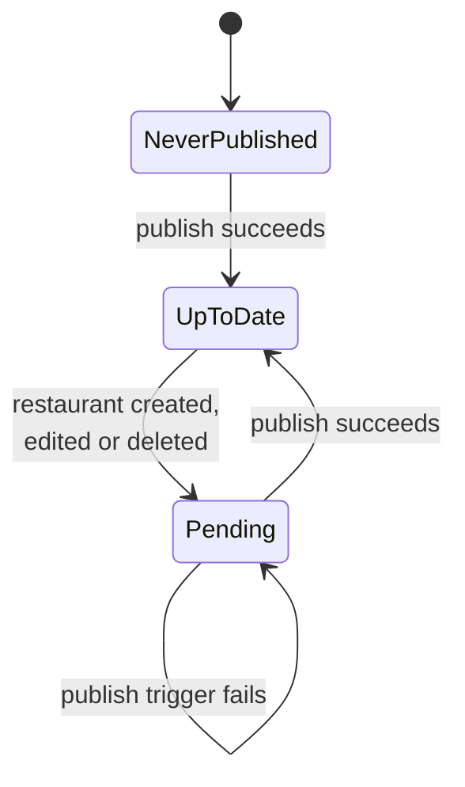
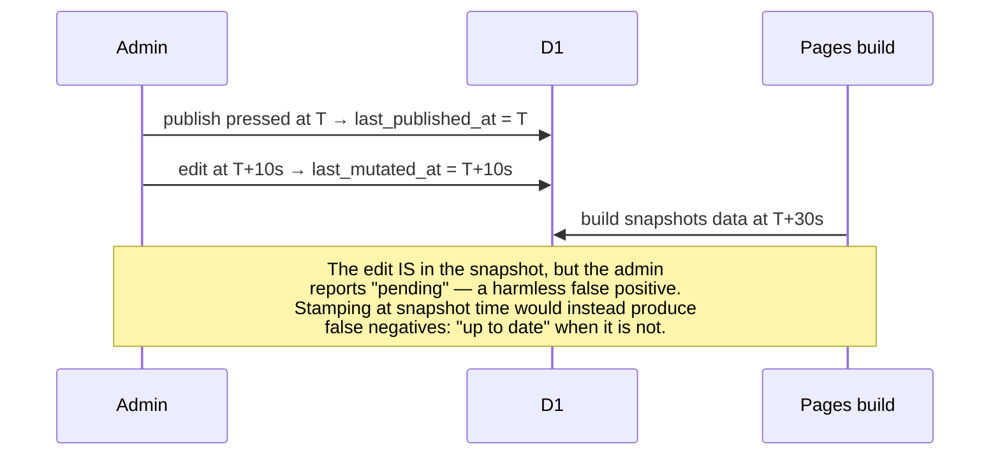

## Context

See `proposal.md` — Why. The constraints that shape the approach:

- The admin is a SvelteKit app on a Cloudflare Worker, sharing the `foodmap` D1 database with
  the public site's build step. Its only current dependencies beyond SvelteKit are the AT
  Protocol OAuth client, Drizzle, and Pico CSS.
- Pico CSS v2 is the styling framework, used class-light with semantic HTML. Custom CSS is
  permitted only as small scoped blocks or CSS-variable overrides — no utility classes.
- The public site is out of scope. Nothing under the repo-root `src/` is modified.
- Publishing is deliberately manual: writes land in D1 immediately, and the public site only
  changes when a Cloudflare Pages deploy hook is fired.

## Goals / Non-Goals

**Goals**

- One layout, one navigation pattern, no viewport branching.
- Make the gap between "what is in D1" and "what is on the public site" continuously visible.
- Remove the class of silent failure where a write appears to succeed but did not, or produced
  unusable data.
- Add no runtime dependencies.

**Non-Goals**

- Verifying that a triggered build actually completed. The deployment identifier is stored (see
  Decision 4b) but never interpreted; verification needs a Cloudflare API token and a new
  permission scope in the admin worker. See Open Questions.
- A per-record change log or activity feed.
- Any map rendering in the admin. See Decision 7.
- Offline capability.

## Decisions

### 1. Bottom tab bar at every width, replacing the responsive hamburger

Three primary destinations is exactly tab-bar sized, and a fixed bottom bar puts all of them in
thumb reach. This deletes the `min-width: 900px` block, the toggle button, the `menuOpen` state
and its `afterNavigate` reset — the new pattern is smaller than the one it replaces.

*Alternatives considered.* Keeping the responsive split (bottom bar narrow, top row wide) was
rejected: it doubles the navigation surface to maintain for a viewport that is rarely used. A
floating action button for "Add" alone was rejected because it solves only the buried-action
problem and leaves the hamburger in place for everything else.

The logout control moves to the persistent header rather than becoming a fourth tab, keeping
the tab bar to primary destinations only. The signed-in handle is not displayed at all: the
app permits one account, so the identity line spent persistent vertical space on a phone to
state something invariant.

### 2. Two timestamps rather than a change log

Publish state is derived from exactly two values:

`last_mutated_at > last_published_at` means pending; `last_published_at IS NULL` means never
published.

*Alternatives considered.* An `updated_at` column on `restaurants`, compared via
`MAX(updated_at)`, is the obvious approach and is **wrong**: a deleted row leaves no timestamp
behind, so deleting the only recently-changed restaurant makes the admin report "up to date"
while the public site still shows it. A single global timestamp is bumped by deletes as
reliably as by inserts. An append-only change log would additionally answer *what* changed, at
the cost of a second table and per-record bookkeeping; for a single-user restaurant list the
question is "is anything pending", not "which six things". The two timestamps remain correct if
a change log is added later.

### 3. Publish is stamped at trigger time, on success only

Stamping when the button is pressed rather than when the build reads D1 makes the failure mode
safe:

Writing the timestamp only when the deploy hook accepts the request means a failed trigger
leaves the pending state showing, which is the correct report.

### 4. The mutation timestamp is owned by the query layer

`queries.ts` already contains the only three restaurant write paths. Bumping the timestamp
inside `createRestaurant`, `updateRestaurant` and `deleteRestaurant` — rather than at their
call sites — means a future write path cannot silently omit it. This is the difference between
an invariant and a convention.

Storage is a single-row table (`id` fixed at 1, `last_mutated_at`, `last_published_at`, both
nullable epoch integers, matching the existing `integer` timestamp convention on the OAuth
tables). The `restaurants` table is untouched, so the migration is purely additive and the
public build script needs no change.

### 4b. The deployment identifier is stored but not interpreted

The deploy hook's response carries an identifier for the deployment it created, and the current
code discards it — `res` is tested for `.ok` and never read. Storing it costs one nullable
column and a parse that is allowed to fail.

This deliberately stops short of verifying the build. Reading a deployment's outcome requires a
Cloudflare API token in the admin worker, which is a categorically broader credential than
anything it holds today: `PAGES_DEPLOY_HOOK_URL` is a capability URL whose worst case is an
unwanted build, whereas an API token — even scoped to Pages reads — can enumerate projects and
deployments across the account. That trade deserves its own decision rather than riding along
inside a UI change.

Retaining the identifier makes the deferral safer in two ways: a suspicious publish can be
traced in the Cloudflare dashboard by hand, and adding verification later becomes purely
additive, since the value it needs is already being recorded.

*Note.* The response shape was not verified during planning — triggering the hook would have
caused a real deployment. The parse must therefore treat the field as optional and must not fail
the publish when it is absent.

### 5. A hand-authored manifest, not `@vite-pwa/sveltekit`

The public site uses `@vite-pwa/sveltekit` because it wants a service worker and tile caching.
The admin wants installability and nothing else — no service worker, no runtime caching, no
precache. Pulling in the plugin to then disable its reason for existing adds a dependency and a
class of bug (a stale shell serving old markup against a live database) for no benefit. A
static manifest plus `viewport-fit=cover` and `theme-color` achieves standalone display on its
own.

The admin's icon reuses the public site's four-line SVG structure — a rounded square holding the
🍽️ glyph — on a distinct ground (`#37474f` rather than `#1095c1`), so the two installed apps read
as one family while staying distinguishable on a home screen. Note that `admin/static/` does not
exist today: `app.html` already references a `favicon.png` that 404s, so the directory has to be
created regardless of the manifest work.

*Trade-off.* Installability without a service worker is well supported on Android/Chrome and on
iOS via "Add to Home Screen". If a future requirement genuinely needs offline behaviour, the
decision should be revisited deliberately rather than inherited.

### 6. Filtering moves to the client

The list page already loads every restaurant on every view (57 records). Filtering in the
browser removes a round trip per keystroke-batch, deletes the `q` search-param handling from
`+page.server.ts`, and makes typing feel immediate on a phone.

*Trade-off.* Search state stops being a URL, so a filtered list is no longer bookmarkable or
shareable. For a single-user admin this is not a loss worth paying a round trip for. If the
dataset grows by an order of magnitude, server-side filtering should return.

Search narrows to names only, matching how the list is actually used; matching tags surfaced
results the admin was not looking for.

### 7. No map in the admin

Recorded because it is the obvious idea and it is wrong for this app. Coordinates are captured
at full double precision. A pin placed by tapping a map is bounded by pixel resolution — around
six meaningful decimal places at high zoom — so a map picker would *reduce* the precision of
the data it exists to improve, while adding `maplibre-gl`, `svelte-maplibre-gl`, and tile-key
configuration to an app that currently ships almost no client JavaScript. Expanding the Google
Maps short link server-side was also investigated: it resolves in one redirect and does yield a
name and coordinates, but only to seven decimal places, and its pin sits several metres from
the value actually recorded. Validation, not assisted capture, is the correct scope here.

### 8. Severity replaces a single alert style

One global rule currently paints every `[role="alert"]` bold red, covering three different
things: failures, an advisory duplicate warning, and a static confirmation question. `role`
`alert` is an assertive live region and belongs only on the first. Advisory notices become
ordinary text, and both the delete confirmation and the creation-success confirmation become
native `<dialog>`s — which Pico v2 already styles via `dialog > article`, including header and
footer, so no modal CSS is written. The success dialog carries "Add another" and "Back to list"
in its footer, so requiring a dismissal costs no extra step when adding restaurants
consecutively. A server-rendered `<dialog open>` keeps the pattern working without client-side
scripting.

Button prominence is likewise decoupled from markup. Pico sets `width: 100%` on
`button[type=submit]` only, which currently renders "Confirm delete" as a full-width primary
and "Cancel" as a small button beside it. Variants are assigned by role instead:
`--pico-del-color` for destructive, `.secondary`/`.outline` for supporting actions, and the
safe choice kept dominant in any destructive confirmation.

### 9. Coordinates stay a single paste target

The coordinate input remains one `lat,lng` text field rather than splitting into separate
latitude and longitude inputs. Capture is a paste of a pair; splitting the field would break that
gesture in exchange for a numeric keyboard on each half — a poor trade when the field is almost
never typed by hand. Validation therefore reports against the single field with one message.

## Risks / Trade-offs

**An accepted deploy hook does not mean the build succeeded** → The admin will report "up to
date" for a build that later failed. Mitigated by wording that claims only that a rebuild was
requested, and by the pending indicator being driven by data changes rather than by build
outcome. Full resolution is deferred; see Open Questions.

**Pending state can be a false positive** → An edit landing between the trigger and the build's
snapshot is included in that build but still reported as pending. The cost is one unnecessary
publish. The alternative stamping strategy produces false negatives instead, which is the
worse error.

**A phone-shaped layout on a desktop screen** → Accepted deliberately. Single-user tool, phone
is the primary context, and the centred column keeps it from looking broken on a wide display.

**`use:enhance` regressions without scripting** → Enhanced submission must remain an
enhancement. Every form keeps working as a plain HTML form submission; the pending and
confirmation behaviour is additive.

**Requiring a URL changes what can be saved** → All 57 existing restaurants already have both a
URL and coordinates, so no stored record becomes invalid. Only new writes are constrained.

## Migration Plan

1. Add the publish-state migration to `admin/drizzle/migrations` — a new single-row table with
   both timestamps nullable. Additive; nothing is altered or dropped.
2. Seed the single row with both timestamps null. The admin then reports "never published"
   until the first publish, which is accurate rather than misleading.
3. Deploy the admin worker. The public site is untouched and needs no redeploy.

**Rollback.** The change is additive at the data layer, so rolling back the worker is
sufficient; the table can be left in place harmlessly. Existing restaurant records are never
rewritten by this change.

**Note on local development.** `admin/drizzle/migrations` covers only the OAuth tables; the
`restaurants` table is applied from the root project. The new table belongs with the admin's
migrations, since the admin alone reads and writes it.

## Open Questions

- **Should the admin verify that a build actually completed?** The deploy hook response
  contains a deployment id that is currently discarded; polling the Cloudflare API with it
  would turn "publish requested" into "publish succeeded". This needs a new secret and API
  scope in the admin worker, and is deliberately out of scope. It is safely deferrable: the
  timestamps and the pending indicator remain correct regardless, and adding build verification
  later extends the publish screen without changing any requirement written here.
