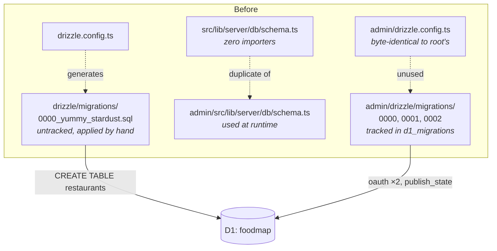
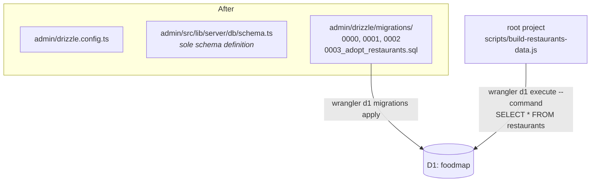

## Context

See `proposal.md` — Why. The constraints that shape the approach:

- **Wrangler tracks applied migrations by filename**, in the `d1_migrations` table. The
  three files already recorded there (`0000_add_atproto_oauth_state.sql`,
  `0001_add_atproto_oauth_session.sql`, `0002_add_publish_state.sql`) can therefore never be
  renamed or renumbered without breaking tracking.
- **Root's migration was never recorded.** `d1_migrations` on remote holds ids 1–3 only.
  `0000_yummy_stardust.sql` ran via `wrangler d1 execute --file`, which does not record
  anything.
- **The two migration sets were produced by different tools.** Root's is drizzle-kit output
  (auto-generated name, `meta/` journal and snapshot, bare `CREATE TABLE`). The admin's three
  are hand-written (descriptive names, no `meta/` directory, `CREATE TABLE IF NOT EXISTS`).
  Only the hand-written convention is compatible with wrangler's runner.
- **The live `restaurants` table already exists** with 59 rows. Whatever lands must not
  attempt to recreate it.

## Goals / Non-Goals

**Goals:**
- One directory owns every D1 migration, applied by one tracked command.
- One definition of the `restaurants` table.
- Reconcile the untracked migration **without hand-editing `d1_migrations` on production**.

**Non-Goals:**
- Changing the `restaurants` table's columns. `add-restaurant-branches` does that, on top of
  this.
- Renumbering or renaming the admin's existing three migrations.
- Making the root project able to run migrations. It is being taken out of that business
  entirely, not given better tooling for it.
- Removing the dead yaml-import script and seed file. See `proposal.md` — Impact.

## Decisions

### Adopt by re-running an idempotent migration, not by inserting into `d1_migrations`

Once root's migration moves into `admin/drizzle/migrations/`, wrangler sees a file that is
not in `d1_migrations` and will try to apply it. Root's version is a bare `CREATE TABLE`,
which fails against the existing table. Two ways out:

| Option | Mechanism | Assessment |
|---|---|---|
| **Chosen: `CREATE TABLE IF NOT EXISTS`** | Wrangler applies it; it is a no-op on remote, a real create on a fresh local DB; recorded either way | Matches the admin's existing house style for all three of its migrations. No manual production step. Self-correcting — works identically on remote, local, and any future database. |
| Rejected: back-record the row | `INSERT INTO d1_migrations` by hand on remote so wrangler skips the file | Hand-writing to production migration bookkeeping to fix a bookkeeping problem. Silently wrong on a fresh local DB, where the table genuinely does need creating. |

The idempotent form is the only one that makes local and remote converge on the same
sequence of commands, which is the point of the change.

### Number it `0003`, and call it `adopt` rather than `create`

`restaurants` predates the admin's three tables but must sort after them, because their
filenames are load-bearing. `0003_adopt_restaurants.sql` therefore carries a number that
contradicts its history. Naming it "adopt" makes the sequence document itself: this file
brings a pre-existing table under management rather than introducing it.

Ordering is functionally irrelevant here — `restaurants`, the two OAuth tables, and
`publish_state` have no foreign keys or other dependencies between them, so a fresh database
can create them in any order.

### The admin owns the schema, despite the public site owning the data

`AGENTS.md` currently reserves `admin/drizzle/migrations` for "the tables the admin alone
reads and writes", explicitly excluding `restaurants`. That rule was a reasonable reading of
conceptual ownership — the public site is what the restaurant data is *for*.

It is superseded by what the code actually does. The admin holds the only runtime D1 binding
and the only drizzle usage. The root project's contact with D1 is a single raw
`wrangler d1 execute --command "SELECT * FROM restaurants"` in
`scripts/build-restaurants-data.js`, which imports no schema and needs no ORM. Conceptual
ownership and operational ownership have diverged, and tooling should follow the operational
one.

The alternative — giving the root project its own `wrangler.jsonc` with a `migrations_dir`
so it can run its own migrations — would keep the stated rule intact at the cost of two
migration runners against one database, and would still leave the duplicated config and
schema files in place. It solves the narrower problem and not this one.

## Risks / Trade-offs

- **Wrangler applies `0003` before anyone notices it is a no-op** → Intended, and safe by
  construction: `IF NOT EXISTS` cannot touch the 59 existing rows. Verify by comparing
  `SELECT COUNT(*) FROM restaurants` before and after.
- **A future contributor renames a tracked migration** → Pre-existing hazard, not introduced
  here, but now concentrated in one directory where a note in `AGENTS.md` can cover it.
- **Root's `drizzle/` directory is left holding only `seed-from-yaml.sql`** → Cosmetically
  odd, and a signal that the dead-script question wants answering soon. Deliberate: see
  `proposal.md` — Impact.
- **Losing drizzle-kit at the root means the root can no longer generate migrations** →
  That is the goal. Schema changes are authored from `admin/`, where drizzle-kit remains.
- **`0003_adopt_restaurants.sql` drifts from the live table** if the two were ever out of
  sync → Confirmed in sync at authoring time: the live table matches root's
  `0000_yummy_stardust.sql` and the `restaurants` block of both `schema.ts` files, which were
  verified byte-identical.

## Migration Plan

1. Land the code change (file moves, deletions, dependency removal, docs).
2. Verify locally first: against a fresh local D1,
   `npx wrangler d1 migrations apply foodmap --local` must produce all four tables from a
   single command.
3. Record `SELECT COUNT(*) FROM restaurants` on remote (expected: 59).
4. From `admin/`, run `npx wrangler d1 migrations apply foodmap --remote`. Expect
   `0003_adopt_restaurants.sql` to be applied and recorded as id 4.
5. Confirm the row count is unchanged and the admin still loads its restaurant list.

**Rollback:** the migration is a no-op against remote, so there is nothing to undo in the
database. If the recorded row is unwanted, `DELETE FROM d1_migrations WHERE name =
'0003_adopt_restaurants.sql'` restores the previous bookkeeping state. Reverting the commit
restores the deleted root files.

**No admin deploy is required.** This change adds no column and alters no query, so
`AGENTS.md`'s "migrations FIRST, then deploy" rule has nothing to sequence here.
