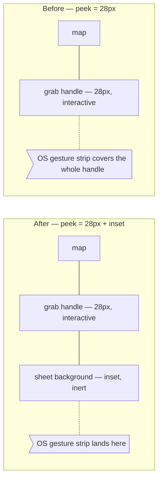
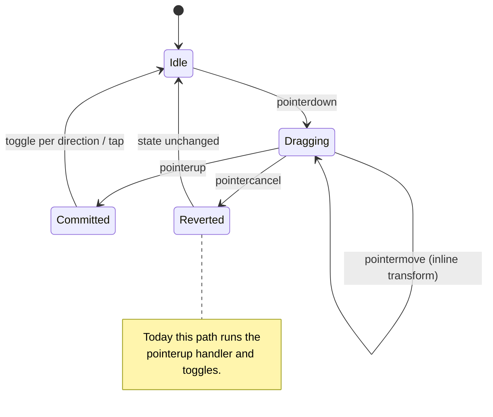

## Context

See `proposal.md` — Why, for the two faults. The constraints that shape the approach:

- The collapsed sheet's offset is `translateY(calc(100% - 28px))`. The peek is set by that
  offset, not by content flow — so padding placed *inside* the sheet below the handle moves
  nothing. The handle sits at the sheet's top edge, and the sheet's top edge stays 28px
  above the screen. Revealing more of the sheet is the only way to lift the handle.
- The 28px is `.grab-handle-area`: 12px padding, a 4px bar, 12px padding. It carries the
  pointer handlers and `touch-action: none`.
- `src/app.html` does not set `viewport-fit=cover`, so `env(safe-area-inset-bottom)`
  reports `0px`. The admin app does set it (`admin/src/app.html:8`), so the project has
  precedent for the opposite choice.
- The drag handler is stateful across three events: `onPointerDown` records `dragStartY`
  and disables the transition; `onPointerMove` writes an inline transform;
  `onPointerUp` clears both and decides whether to toggle. `onpointercancel` is currently
  bound to `onPointerUp`.

## Goals / Non-Goals

**Goals**

- The collapsed sheet has no touch target inside the OS gesture strip.
- A gesture the OS claims leaves the sheet exactly as it was.
- The sheet's surface still meets the bottom of the screen — no map showing beneath it.

**Non-Goals**

- Adopting `viewport-fit=cover` (Decision 1).
- Changing the sheet's height, its desktop form, or the drag thresholds.
- Reworking `.location-button`'s hand-tuned `bottom: 2.5rem` in `RestaurantMap.svelte`.
  It happens to clear the same strip; making that explicit belongs to a change about the
  map's own controls.

## Decisions

### Decision 1: Size the inset `max(env(safe-area-inset-bottom), 28px)`, and do not adopt `viewport-fit=cover`

`env(safe-area-inset-bottom)` is the correct way to learn the home-indicator height — 34px
on most modern iPhones, 0 on a device with a physical home button. It only reports a real
value when the viewport meta carries `viewport-fit=cover`, which the public site does not
set.

Adopting `cover` is page-wide. It would hand the site the whole screen, and with it
responsibility for the top strip too: `.search-box` at `top: 1rem` would slide under the
status bar and need `calc(1rem + env(safe-area-inset-top))`, the map would need to paint
under both strips, and the sheet's `70dvh` would be measured against a taller viewport.
That is a deliberate visual-polish change across the whole page — worth doing on its own
terms, not smuggled in as part of a gesture-conflict fix.

Writing the inset as `max(env(safe-area-inset-bottom), 28px)` costs nothing: the `env()`
resolves to `0px` today and the `28px` floor carries the fix. If the site later adopts
`cover`, the expression upgrades itself without being revisited.

**Alternatives considered.** A bare `28px` — simpler, but forecloses the upgrade and would
have to be found and changed later. Adopting `cover` now — correct on iOS, but drags in
unrelated top-of-screen work, and on Android Chrome the inset is commonly `0px` anyway, so
the floor would still be doing the work.

28px clears Android's gesture strip and most of iOS's 34px indicator. On iOS without
`cover` the browser has *already* inset the page above the indicator, so the 28px is extra
clearance rather than the whole defence.

### Decision 2: Lengthen the peek rather than lifting the sheet off the bottom

The inset is added to the collapsed offset, so the sheet reveals `28px + inset` and the
strip below the handle is sheet background carrying no handlers.

Lifting the whole sheet with `bottom: <inset>` was the alternative. It is a smaller
expression, but leaves a band of live map beneath the sheet — which looks wrong against the
sheet's rounded top and square bottom, and merely swaps the conflict: map pan gestures
would then fight the home gesture instead of the handle.

The inert strip must be inert by construction, not by CSS alone: it is outside
`.grab-handle-area`, so it inherits neither the pointer handlers nor `touch-action: none`.

### Decision 3: `pointercancel` reverts; only `pointerup` commits

`pointercancel` means the gesture was taken away. Binding it to `onPointerUp` makes a
stolen gesture commit a toggle it was never released to authorise — and because
`onPointerUp` reads `e.clientY`, the cancel's last known position decides the direction.

It needs its own handler that does what `onPointerUp` does *minus* the toggle: clear
`dragging`, restore the transition, and clear the inline transform so the sheet animates
back to whichever state `open` still holds.

This matters beyond the strip overlap: any OS or browser interruption mid-drag currently
commits, and would keep doing so even with Decision 2 in place.

### Decision 4: Pad the scroll container, not the sheet

The same inset goes on `.sidebar-scroll`'s `padding-bottom`, so the last restaurant card —
itself a `role="button"` target — clears the strip when the list is open. Padding the sheet
instead would inset the scrolling viewport rather than its content, cutting the scroll
short of the sheet's edge.

## Risks / Trade-offs

- **The collapsed sheet is visibly taller** → It grows by the inset, roughly doubling the
  peek. The added strip is plain sheet background against a rounded top edge, so it reads
  as the sheet sitting slightly higher rather than as new furniture.
- **28px is a guess at a value the platform will not report** → It is a floor, not a
  measurement, and is deliberately generous against Android's ~20px and iOS's 34px. The
  `env()` half makes it self-correcting if `cover` is ever adopted.
- **`pointercancel` firing on gestures we did not anticipate** → Reverting is the safe
  default in every case: the worst outcome is a drag the visitor has to repeat, versus the
  current worst outcome of a toggle they did not ask for.
- **The `70dvh` sheet height is unchanged** → With more of the sheet revealed when
  collapsed, the open and collapsed positions differ by slightly less. No requirement
  depends on that distance.

## Migration Plan

Presentational change to one component; no data, build, or admin involvement. Deploys with
the next publish and is reverted by reverting the commit.

Verification needs a real phone with the site installed to the home screen — the conflict
does not reproduce in a desktop browser or in device emulation, since neither has an OS
gesture strip. Both stated symptoms are checked directly: swiping up to go home leaves the
list collapsed, and returning to the app finds it still collapsed.
