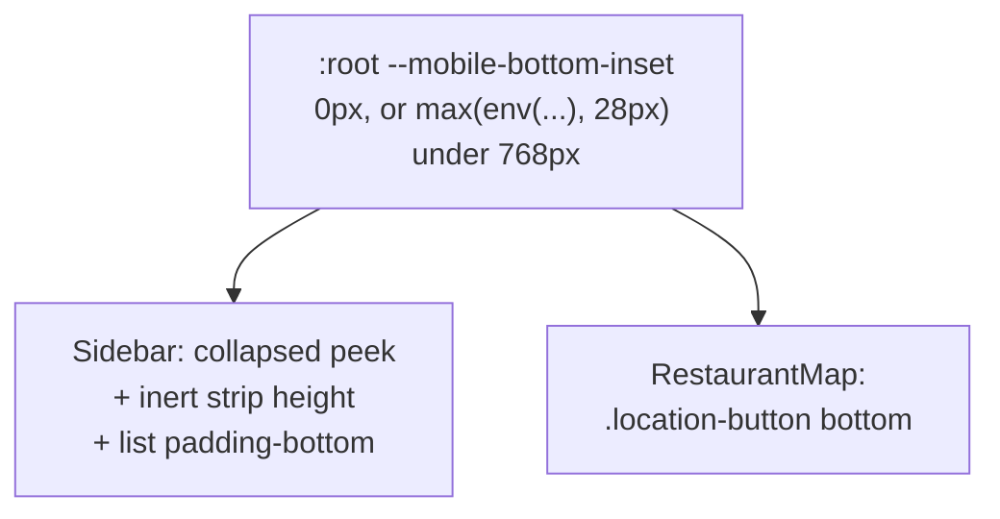

## Context

See `proposal.md` — Why. The constraints that shape the approach:

- `--gesture-inset` is declared on `.sidebar` inside `Sidebar.svelte`'s scoped styles, so
  it is reachable only by that component's subtree. `RestaurantMap.svelte` cannot read it.
- `src/routes/+layout.svelte` is the project's only home for global styles (see
  `AGENTS.md` — Styling). It already carries `:global(html)` / `:global(body)` rules.
- `.location-button` is `position: absolute` within `.map-wrapper`, which is `inset: 0`
  inside `.app`. Its `bottom` is therefore measured from the same screen edge the sheet's
  peek is measured from — the two are directly comparable.
- `collapsedPeek()` in `Sidebar.svelte` measures `.grab-handle-area` plus `.gesture-strip`
  live, on every `pointermove`. It was written that way deliberately, so the drag maths
  could not drift from an `env()` expression only the browser can resolve.
- A custom property's computed value is its unsubstituted token stream: reading
  `--gesture-inset` back with `getComputedStyle` yields the literal string
  `max(env(safe-area-inset-bottom), 28px)`, not a pixel count. Any measurement must come
  from a rendered box.

## Goals / Non-Goals

**Goals**

- One declaration of the bottom clearance, read by every element that needs it.
- The open sheet looks as it did before the gesture work.
- The location button clears the collapsed sheet.
- The handle stops taking a text selection, without losing keyboard focus visibility.

**Non-Goals**

- Adopting `viewport-fit=cover`. Still deferred; see
  `keep-sheet-clear-of-home-gesture/design.md` — Decision 1.
- Making the location button track the sheet. Confirmed with the project owner: it sits
  above the collapsed sheet and stays put when the list opens.
- Revisiting the 28px floor, which is verified on device.

## Decisions

### Decision 1: Declare the inset once on `:root` in the root layout

The inset moves to `src/routes/+layout.svelte` as `--mobile-bottom-inset`, declared on
`:root` with a desktop value of `0px` and overridden to
`max(env(safe-area-inset-bottom), 28px)` inside the same `max-width: 768px` breakpoint the
sheet already uses.

Giving it a real `0px` on desktop lets both consumers use it unconditionally — no
component needs its own breakpoint to decide whether the inset applies, which is how the
`2.5rem` literal came to disagree with the peek in the first place.

`:root` is not scoped by Svelte, so the declaration escapes the layout's style block as
intended, and the root layout is where this project puts global styles regardless.

**Alternative considered.** Declaring it on `.app` in `+page.svelte`. That is nearer the
elements that use it, but `.app` is a page-level element while the value describes the
device, and it would put a global-by-intent token outside the file the project reserves
for global styles.

### Decision 2: Take the inert strip out of flow when the sheet is open, rather than out of the DOM

The gap under the handle exists because `.gesture-strip` is a flex item in both states.
The obvious fix — `display: none` when open — breaks `collapsedPeek()`: it measures the
strip, and while the sheet is open it must still report the *collapsed* peek so that
dragging an open sheet downward clamps to the right travel. A hidden strip measures `0`,
and the sheet would clamp short by the inset.

So when the sheet is open the strip becomes `position: absolute; bottom: 0` instead. It
leaves the flex column, the gap closes, and it keeps a rendered box that `offsetHeight`
still reports correctly. The measurement stays honest in both states without
`collapsedPeek()` learning anything about which state it is in.

**Alternatives considered.** Caching the peek while collapsed — a stale value across
orientation changes, and the caching rule becomes another thing to keep in sync. Reading
the custom property back — impossible, per Context. Reordering the strip to the bottom of
the flex column when open — works, but leaves it stacked with the list's own
`padding-bottom`, which would then double the clearance.

### Decision 3: Position the location button against the inset plus the handle

The button's `bottom` becomes the collapsed peek plus a gap:
`calc(28px + var(--mobile-bottom-inset) + <gap>)`. The `28px` is the handle area's own
height, which is a literal in the sheet's transform too.

That the handle height appears in two files is the residue of this fix, not its point: the
value that *moves with the device* is now shared, and the one that stays put is a constant.
Promoting the handle height to a second token as well would be tidier, and is deliberately
not done — one shared token for the thing that varies is the fix; a second for a fixed 28px
is bookkeeping.

### Decision 4: Suppress selection and tap highlight, keep focus visible

`user-select: none` and `-webkit-tap-highlight-color: transparent` on `.grab-handle-area`
and `.gesture-strip`. The handle carries no text, so selection has nothing to offer and
the browser's attempt to provide it is the artefact.

Both elements need it: the reported blue line appears to be a selection range starting on
the handle and extending into the empty strip beneath it, so treating only the handle would
likely leave the line behind.

`user-select: none` does not affect focus, and the handle is a `role="button"` with
`tabindex="0"` that must stay keyboard-operable. A `:focus-visible` outline is added so
keyboard focus remains visible while the pointer-driven highlight goes away —
`:focus-visible` rather than `:focus`, so a tap does not reintroduce a ring.

## Risks / Trade-offs

- **`position: absolute` on the strip changes what it overlays when open** → It sits at the
  sheet's bottom edge, over the list's `padding-bottom`, which is empty by construction.
  It has no background and no handlers, so it is invisible and inert either way.
- **The desktop `0px` value silently disables the clearance if a breakpoint is edited** →
  Correct behaviour, since desktop has no gesture strip, but it means a mistake in the
  breakpoint fails quietly rather than loudly. The device test catches it.
- **`-webkit-tap-highlight-color` is a non-standard property** → Widely supported on the
  mobile browsers this targets, and inert where it is not.
- **Two files now reference a 28px handle height** → Accepted; see Decision 3.

## Migration Plan

Presentational changes across three components; no data, build, or admin involvement.
Deploys with the next publish and is reverted by reverting the commit.

Verification is on a phone with the site installed to the home screen, and must re-check
the previous change's behaviour as well as this one's: the collapsed handle must still
clear the home gesture, and dragging an open sheet closed must still land correctly, since
Decision 2 changes how the peek is measured.
