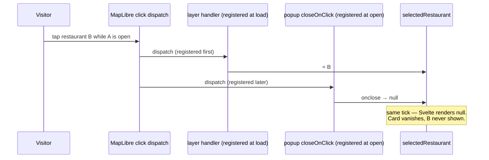
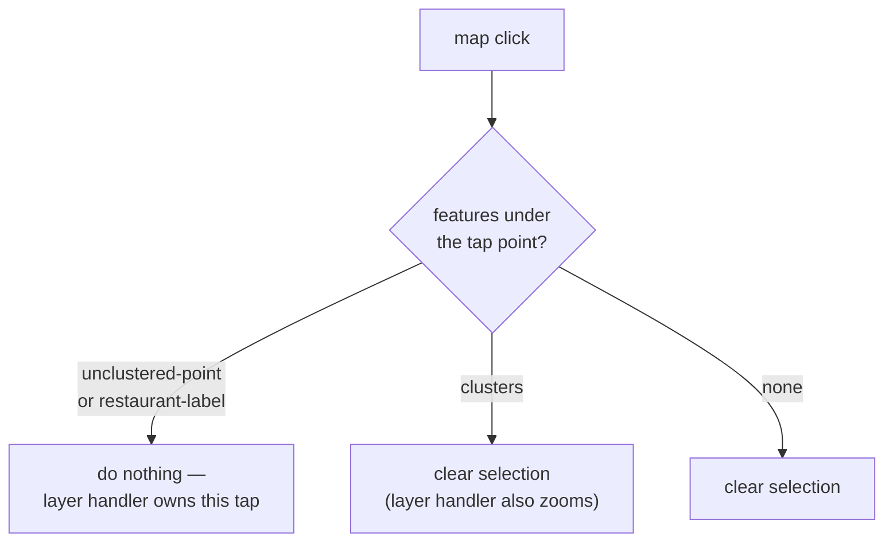

## Context

See `proposal.md` — Why, for the listener-ordering cause. The constraints that shape the
approach:

- `selectedRestaurant` is a single `$state` slot. The popup is rendered from an `{#if}` on
  it, and `onclose` writes `null` back into it. So the popup's own lifecycle can overwrite
  a selection made elsewhere in the same tick.
- Layer click handlers are registered once in `handleMapLoad`. MapLibre's `closeOnClick`
  registers its listener when the popup is *added*, so it is always later in the list and
  always runs second.
- Svelte batches within a tick. Two writes in one event dispatch render only the last, so
  the erased selection never paints — the tap looks ignored rather than reverted.

## Goals / Non-Goals

**Goals**

- One tap moves from any restaurant's card to any other's.
- Dismissal by background tap survives, since `closeButton` is `false` and it is the only
  way to close a card.
- The fix does not depend on listener registration order.

**Non-Goals**

- Adding a close button to the popup.
- Changing popup contents, styling, or the `navigateToRestaurant` fly-to behaviour.
- Reworking how `selectedRestaurant` is stored.

## Decisions

### Decision 1: Turn off `closeOnClick` and own dismissal explicitly

`closeOnClick` is a convenience that assumes the popup is the only thing interested in map
clicks. Here it is not: the restaurant layers are, and the option's listener runs after
them. There is no way to reorder MapLibre's internal registration, so the option has to go.

Setting `closeOnClick={false}` alone would leave cards with no dismissal at all. The
behaviour it provided is reimplemented as an explicit handler — which also makes the
dismissal rule legible in the component instead of implied by a library default.

### Decision 2: Decide dismissal by hit-testing, not by registration order

The replacement handler could be registered before the layer handlers and simply clear the
selection, relying on the layer handler to set it afterwards. That works, and it is exactly
the fragility that caused this bug — a correctness property held only by the order two
`on('click')` calls happen to appear in.

Instead the handler queries the rendered features under the tap point and clears the
selection only when the tap hit none of the restaurant layers. Correct whichever order it
runs in.

The layer handler stays as it is: it sets the selection, and nothing now unsets it in the
same tick.

**Alternative considered.** Guarding inside `onclose` — ignore the close when the selection
has just changed. That needs a "just changed" sentinel with a lifetime measured in ticks,
and leaves the real ordering hazard in place for the next handler someone adds.

### Decision 3: A group tap dismisses the open card

Confirmed with the project owner. Expanding a group re-centres and zooms the map, so an
open card describes a restaurant that may no longer be on screen. Dismissing keeps the card
an assertion about what the visitor is currently looking at.

This falls out of Decision 2 for free: `clusters` is simply not in the set of layers that
suppress the clear.

### Decision 4: Reselecting the open restaurant is a no-op

Writing the same restaurant into `selectedRestaurant` leaves the popup open, which is the
behaviour the spec requires. No special handling — recording it here because the current
code reaches the same outcome through `closeOnClick` closing and the layer handler
reopening, and that coincidence disappears with Decision 1.

## Risks / Trade-offs

- **Hit-testing runs on every map click** → A `queryRenderedFeatures` call bounded to three
  layers at a point, on a discrete click. Negligible against the pan and zoom work the map
  already does per frame.
- **The layer list is now stated in two places** — the layer click registration and the
  dismissal handler → A layer added to one and not the other would make taps on it dismiss
  the card. Naming the set once in the component and using it in both is enough.
- **Dismissal semantics move from a library default into project code** → More code, but
  the rule is now readable where the behaviour lives rather than implied by an unset
  option. That the default was invisible is what made this bug hard to see.

## Migration Plan

Behavioural change to one component; no data, build, or admin involvement. Deploys with the
next publish and is reverted by reverting the commit.

Verification is by hand on the map: tap one restaurant, then a second, and confirm the
second card appears from that single tap; then confirm background tap and group tap both
dismiss, and that panning with a card open leaves it open.
